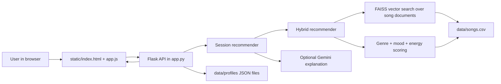

# RhythmFlow

RhythmFlow is a small music recommendation app. You type a request like "chill lofi for studying" or "high energy rock for the gym," and it returns songs from a local catalog with a short explanation for each match.

I built this project to make recommendation logic easier to see. Big music apps hide a lot behind the word "algorithm." RhythmFlow keeps the moving parts small: song metadata, vector search, a weighted score, and an optional Gemini explanation. That makes it easier to test where the system does well and where it starts making weird choices.


## What the project does

The app has a few jobs:

- Score songs by genre, mood, and energy.
- Search song descriptions with FAISS so natural language queries still work.
- Let users chat with the recommender, give thumbs up/down feedback, save profiles, load profiles, and generate playlists.

Gemini is only used to write the explanation text. It does not choose the songs. The ranking comes from the local recommender, so the app can still return results if the LLM is missing, busy, or not configured.

## Architecture overview



The browser talks to the Flask API in `app.py`. Flask creates a session recommender, loads songs from `data/songs.csv`, and sends each query through the hybrid recommender. The RAG side looks for songs whose metadata sounds close to the user's request. The scoring side checks the more direct preferences: genre, mood, and target energy.

Profiles and feedback are saved as JSON files in `data/profiles`. That is simple and easy to inspect, which is good for this project. It would not be enough for a real multi-user app.

## How to run it

1. Create and activate a virtual environment.

   ```bash
   python3 -m venv .venv
   source .venv/bin/activate
   ```

   On Windows:

   ```bash
   .venv\Scripts\activate
   ```

2. Install dependencies.

   ```bash
   pip install -r requirements.txt
   ```

3. Add a Gemini key if you want AI-written explanations.

   ```bash
   touch .env
   ```

   Add this line to `.env`:

   ```text
   GEMINI_API_KEY=your-key-here
   ```

   This is optional. Without the key, the recommender still ranks songs, but Gemini explanations will not be available.

4. Run the web app.

   ```bash
   python3 app.py
   ```

5. Open the app.

   ```text
   http://localhost:5001
   ```

6. Run the command line demo if you want to see the recommender without the UI.

   ```bash
   python3 -m src.main
   ```

## API endpoints

- `GET /health` checks whether the Flask server is running.
- `POST /api/chat` returns recommendations for a natural language query.
- `POST /api/feedback` records thumbs up/down feedback.
- `POST /api/playlist` builds a playlist from the current profile.
- `GET /api/profile` returns the current session profile.
- `POST /api/profile` saves or loads a profile.
- `GET /api/profiles` lists saved profiles.
- `GET /api/export/<user_id>` exports feedback for a saved profile.
- `GET /api/session` returns a session summary.

## Design decisions and tradeoffs

The song catalog is a CSV file on purpose. It is easy to open, edit, and reason about. The downside is obvious: a real music product would need a database, a much larger catalog, and better validation around the data.

The recommender uses both semantic search and content scoring. FAISS helps with messy human requests like "music for coding late at night." The weighted score keeps the final ranking tied to concrete fields in the data. Genre is worth 1.5 points, mood is worth 1.0, and energy can add up to 1.0. That makes the output explainable, but it also means the weights matter a lot. If one genre has only one song, the system cannot magically recommend variety.

I kept Gemini out of the ranking step. That choice makes the system easier to debug because the LLM is not secretly changing the order of results. The cost is that the written explanation can fail separately from the recommendation itself. The frontend handles that by showing a cleaner message when Gemini is busy.

Session data lives in memory, and saved profiles are JSON files. That is fine for a local demo. It also means sessions reset when the server restarts, and two users writing to the same profile would be a problem.

## Test summary

Run the tests with:

```bash
python3 -m pytest
```

What worked:

- The basic recommender returns songs in score order.
- The explanation function returns text instead of an empty string.
- The chill lofi profile favors chill lofi tracks.
- The dashboard keeps the element IDs that `static/app.js` depends on.
- Gemini tests use fake SDK clients, so the test suite does not need a real API call.
- Busy Gemini errors get turned into a readable message for the UI.

What still needs work:

- Contradictory requests, like high energy plus melancholic metal, still force a compromise instead of asking the user to clarify.
- Missing genres or moods fall back mostly to energy and semantic similarity, which can make the results feel off.
- Tempo, valence, danceability, and acousticness are in the dataset, but the main weighted score only uses genre, mood, and energy.
- The catalog is tiny. It works for showing the recommender behavior, not for serious music discovery.

## Future improvements

- Detect conflicting preferences before ranking.
- Add tempo, valence, danceability, and acousticness to the score.
- Add more songs for genres that only have one or two examples.
- Store profiles and feedback in a database.
- Let users adjust the scoring weights from the UI.

See [model_card.md](model_card.md) for more detail on limitations, bias, and evaluation.
